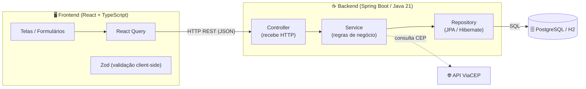
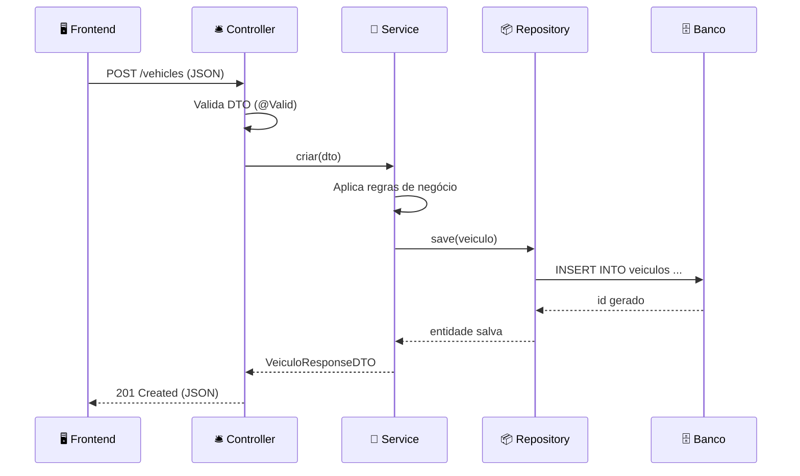
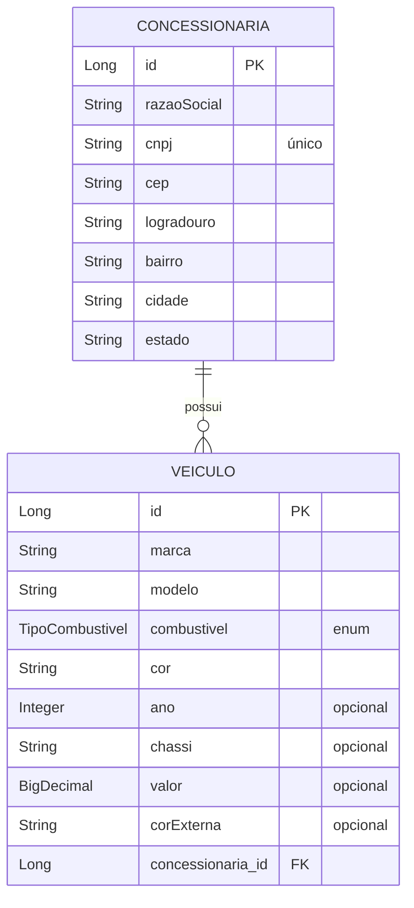

# 🚗 Gestão de Veículos e Concessionárias

Aplicação **full stack** para gestão de veículos e concessionárias parceiras de uma montadora, permitindo o cadastro, consulta, alteração e exclusão de registros, com **frontend e backend separados** consumindo **APIs REST**.

> Desafio Técnico — Cargo: Desenvolvedor Full Stack

---

## 📑 Índice

- [Visão Geral](#-visão-geral)
- [Arquitetura da Solução](#-arquitetura-da-solução)
- [Tecnologias](#-tecnologias)
- [Como Executar](#-como-executar)
- [Endpoints da API](#-endpoints-da-api)
- [Modelo de Dados](#-modelo-de-dados)
- [Validações](#-validações)
- [Diferenciais Implementados](#-diferenciais-implementados)
- [Decisões Técnicas](#-decisões-técnicas)
- [Estrutura de Pastas](#-estrutura-de-pastas)

---

## 🎯 Visão Geral

O sistema permite:

- ✅ Cadastro, consulta, edição e exclusão de **veículos**;
- ✅ Cadastro, consulta, edição e exclusão de **concessionárias**;
- ✅ **Associação** de veículos a concessionárias (um-para-muitos);
- ✅ **Consulta automática de endereço via ViaCEP** ao informar o CEP;
- ✅ **Validação de CNPJ** com cálculo dos dígitos verificadores;
- ✅ Documentação interativa da API com **Swagger/OpenAPI**.

---

## 🏛️ Arquitetura da Solução

A aplicação segue uma arquitetura em **camadas (layered architecture)**, com separação clara de responsabilidades entre frontend, backend e banco de dados, comunicando-se via **HTTP/REST (JSON)**.

### Visão macro (Frontend → Backend → Banco)



### Fluxo de uma requisição (ex.: criar veículo)



### Camadas do Backend

| Camada | Responsabilidade | Analogia 🍔 |
|---|---|---|
| **Controller** | Recebe requisições HTTP e devolve respostas REST | 🛎️ Garçom |
| **Service** | Concentra as regras de negócio | 🧠 Chef |
| **Repository** | Persistência de dados (JPA/Hibernate) | 📦 Despenseiro |
| **Entity** | Mapeamento objeto-relacional (ORM) | 🏷️ Etiqueta |
| **DTO** | Transporte de dados entre camadas | 🎁 Marmita |
| **Mapper** | Conversão DTO ↔ Entity | 🔁 Tradutor |

---

## 🛠️ Tecnologias

### Backend
- **Java 21**
- **Spring Boot 3.3**
- **Spring Data JPA / Hibernate**
- **Bean Validation** (Jakarta Validation)
- **Maven**
- **PostgreSQL** (produção/Docker) e **H2** (execução local rápida)
- **springdoc-openapi** (Swagger UI)
- **Lombok**
- **JUnit 5 + Mockito** (testes)

### Frontend *(a implementar)*
- **React + TypeScript + Vite**
- **TanStack Query (React Query)**, **React Hook Form**, **Zod**, **React Router**

### Infraestrutura
- **Docker** (multi-stage build)
- **Docker Compose** (orquestração app + banco)

---

## 🚀 Como Executar

### Opção 1 — Com Docker (recomendado) 🐳

Suba a aplicação **e** o banco PostgreSQL com um único comando:

```bash
docker compose up --build
```

- API: `http://localhost:8080`
- Swagger: `http://localhost:8080/swagger-ui.html`

Para parar:

```bash
docker compose down
```

### Opção 2 — Local com Maven (banco H2 em memória) ☕

Requisitos: **Java 21** e **Maven**.

```bash
mvn spring-boot:run
```

- API: `http://localhost:8080`
- Swagger: `http://localhost:8080/swagger-ui.html`
- Console do H2: `http://localhost:8080/h2-console`
  - JDBC URL: `jdbc:h2:mem:gestaodb` — usuário: `sa` — senha: *(vazia)*

### Rodar os testes

```bash
mvn test
```

Após rodar, o relatório de **cobertura de testes (JaCoCo)** fica em:
`target/site/jacoco/index.html`

**Suíte de testes incluída:**

| Tipo | Arquivo | O que valida |
|---|---|---|
| Unitário (Service) | `VeiculoServiceTest` | Regras de criação e erro 404 |
| Unitário (Service) | `ConcessionariaServiceTest` | CNPJ duplicado + preenchimento ViaCEP |
| Unitário (Validação) | `CnpjValidatorTest` | Cálculo dos dígitos verificadores |
| Integração (Web) | `VeiculoControllerTest` | Status HTTP 200/201/400/404 via MockMvc |
| Integração (Repositório) | `VeiculoRepositoryTest` | Consultas JPA em banco H2 real |

### Deploy na AWS ☁️

Guia completo (Elastic Beanstalk, ECS Fargate, RDS, S3/CloudFront e CI/CD) em:
**[`aws/DEPLOY-AWS.md`](aws/DEPLOY-AWS.md)**

---

## 🔌 Endpoints da API

### Veículos

| Método | Endpoint | Descrição |
|---|---|---|
| `GET` | `/vehicles` | Lista todos os veículos |
| `GET` | `/vehicles/{id}` | Busca um veículo pelo id |
| `POST` | `/vehicles` | Cria um novo veículo |
| `PUT` | `/vehicles/{id}` | Atualiza um veículo |
| `DELETE` | `/vehicles/{id}` | Exclui um veículo |
| `PATCH` | `/vehicles/{id}/dealer/{dealerId}` | Associa/troca a concessionária do veículo |

### Concessionárias

| Método | Endpoint | Descrição |
|---|---|---|
| `GET` | `/dealer` | Lista todas as concessionárias |
| `GET` | `/dealer/{id}` | Busca uma concessionária pelo id |
| `POST` | `/dealer` | Cria concessionária (busca endereço no ViaCEP se enviar o CEP) |
| `PUT` | `/dealer/{id}` | Atualiza uma concessionária |
| `DELETE` | `/dealer/{id}` | Exclui uma concessionária |
| `GET` | `/dealer/{id}/vehicles` | Lista os veículos de uma concessionária |

### CEP (ViaCEP)

| Método | Endpoint | Descrição |
|---|---|---|
| `GET` | `/cep/{cep}` | Retorna o endereço de um CEP |

### Exemplo de requisição

```http
POST /dealer
Content-Type: application/json

{
  "razaoSocial": "Auto Center JP",
  "cnpj": "11.222.333/0001-81",
  "cep": "58400-000"
}
```

> O endereço (logradouro, bairro, cidade, estado) é preenchido **automaticamente** pelo ViaCEP.

---

## 🗃️ Modelo de Dados



Relacionamento **um-para-muitos**: uma concessionária possui vários veículos; cada veículo pertence a, no máximo, uma concessionária.

---

## ✅ Validações

- **Campos obrigatórios**: `@NotBlank` / `@NotNull` nos DTOs de entrada;
- **CNPJ válido**: anotação personalizada `@CNPJ` com cálculo dos dígitos verificadores (módulo 11);
- **CEP válido**: verificado no `ViaCepService` (8 dígitos + retorno do ViaCEP);
- **Enum de combustível**: `GASOLINA`, `ETANOL`, `FLEX`, `DIESEL`, `ELETRICO`, `HIBRIDO`;
- **CNPJ único**: regra de negócio impede cadastro duplicado.

Erros são tratados de forma centralizada por um `@RestControllerAdvice`, retornando respostas JSON padronizadas (400, 404).

---

## ⭐ Diferenciais Implementados

- [x] **Integração ViaCEP** — preenchimento automático de endereço;
- [x] **Validação de CNPJ** com dígitos verificadores;
- [x] **Swagger / OpenAPI** — documentação interativa;
- [x] **Docker + Docker Compose** — containerização de app e banco;
- [x] **Testes unitários** — JUnit 5 + Mockito;
- [x] **Tratamento global de exceções** — respostas de erro padronizadas;
- [x] **Logs estruturados** — via SLF4J.

- [x] **Deploy em AWS** — ECS Fargate + RDS + S3/CloudFront (ver `aws/DEPLOY-AWS.md`);
- [x] **CI/CD** — pipeline no GitHub Actions (`.github/workflows/ci-cd.yml`);
- [x] **Cobertura de testes** — relatório JaCoCo;
- [x] **Health check** — Spring Boot Actuator (`/actuator/health`).

### Próximos diferenciais (roadmap)
- [ ] Observabilidade avançada (logs estruturados JSON, métricas Prometheus);
- [ ] Testes E2E do frontend (Playwright/Cypress).

---

## 🧠 Decisões Técnicas

1. **Arquitetura em camadas + SOLID**: separação Controller/Service/Repository para baixo acoplamento e alta coesão, facilitando testes e manutenção.
2. **DTOs + Mapper**: as entidades JPA nunca são expostas diretamente na API, evitando vazamento de detalhes internos e problemas de serialização (lazy loading).
3. **`record` para DTOs**: imutabilidade e menos código boilerplate.
4. **Validação em duas camadas**: client-side (Zod, no frontend) e server-side (Bean Validation), garantindo dupla proteção.
5. **H2 para desenvolvimento, PostgreSQL para produção**: agilidade local sem abrir mão de um banco robusto no deploy.
6. **Docker multi-stage**: imagem final enxuta (apenas JRE + `.jar`), acelerando o deploy.
7. **Configuração externalizada**: credenciais e URLs injetadas por variáveis de ambiente (12-factor app).

---

## 📂 Estrutura de Pastas

```
desafio/
├── Dockerfile
├── docker-compose.yml
├── pom.xml
├── README.md
└── src
    ├── main
    │   ├── java/com/montadora/gestao
    │   │   ├── config/          # Configuração (RestClient do ViaCEP)
    │   │   ├── controller/      # Camada REST (Veículo, Concessionária, CEP)
    │   │   ├── dto/             # Objetos de transporte (Request/Response)
    │   │   ├── entity/          # Entidades JPA
    │   │   ├── enums/           # TipoCombustivel
    │   │   ├── exception/       # Tratamento global de erros
    │   │   ├── mapper/          # Conversão DTO ↔ Entity
    │   │   ├── repository/      # Camada de persistência (JPA)
    │   │   ├── service/         # Regras de negócio
    │   │   └── validation/      # Validação personalizada de CNPJ
    │   └── resources
    │       └── application.properties
    └── test
        └── java/com/montadora/gestao/service
            └── VeiculoServiceTest.java
```

---

## 👤 Autor

**Leandro Gomes de Brito** — Custom Software Engineering Associate

Desenvolvido como parte do Desafio Técnico de Desenvolvedor Full Stack.
