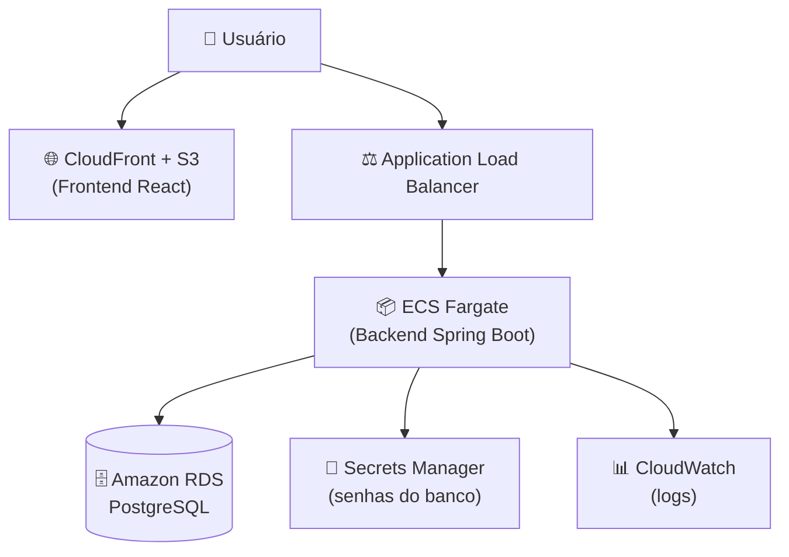

# ☁️ Guia de Deploy na AWS — Conduzir

> Guia passo a passo para publicar a aplicação **Conduzir** na nuvem da AWS.
> Apresenta **duas rotas**: uma simples (para começar) e uma profissional (para impressionar).

---

## 🗺️ Visão geral da arquitetura na nuvem



| Peça AWS | Para que serve | Analogia 🧒 |
|---|---|---|
| **S3 + CloudFront** | Hospeda o frontend (arquivos estáticos) | A vitrine da loja |
| **ECS Fargate** | Roda o container do backend sem gerenciar servidor | A cozinha automática |
| **RDS PostgreSQL** | Banco de dados gerenciado | A despensa da nuvem |
| **ALB** | Distribui o tráfego e faz health check | O porteiro |
| **ECR** | Guarda as imagens Docker | O armário de caixas 📦 |
| **Secrets Manager** | Guarda senhas com segurança | O cofre 🔐 |
| **CloudWatch** | Guarda os logs | A câmera de segurança |

---

## 🥉 Rota 1 — Simples (Elastic Beanstalk) — recomendada para começar

O **Elastic Beanstalk** cuida de quase tudo sozinho (servidor, load balancer, escala).

### Passo a passo

1. **Criar o banco (RDS PostgreSQL)**
   - Console AWS → RDS → *Create database* → PostgreSQL → *Free tier*.
   - Anote: endpoint, usuário e senha.

2. **Gerar o `.jar`**
   ```bash
   mvn clean package -DskipTests
   ```

3. **Instalar e configurar o EB CLI**
   ```bash
   pip install awsebcli
   eb init -p docker conduzir-backend --region us-east-1
   ```

4. **Criar o ambiente com as variáveis do banco**
   ```bash
   eb create conduzir-prod \
     --envvars SPRING_PROFILES_ACTIVE=prod,\
   DB_URL=jdbc:postgresql://SEU_ENDPOINT:5432/gestaodb,\
   DB_USERNAME=postgres,DB_PASSWORD=SUA_SENHA
   ```

5. **Fazer o deploy**
   ```bash
   eb deploy
   eb open   # abre a URL pública no navegador
   ```

✅ Pronto! Sua API está no ar em uma URL `.elasticbeanstalk.com`.

---

## 🥇 Rota 2 — Profissional (ECS Fargate + ECR) — para impressionar

Esta rota é a que um **arquiteto de verdade** usa em produção.

### 1) Enviar a imagem Docker para o ECR

```bash
# Cria o repositório de imagens
aws ecr create-repository --repository-name conduzir-backend --region us-east-1

# Faz login no ECR
aws ecr get-login-password --region us-east-1 | \
  docker login --username AWS --password-stdin <SEU_ACCOUNT_ID>.dkr.ecr.us-east-1.amazonaws.com

# Constrói e envia a imagem
docker build -t conduzir-backend .
docker tag conduzir-backend:latest <SEU_ACCOUNT_ID>.dkr.ecr.us-east-1.amazonaws.com/conduzir-backend:latest
docker push <SEU_ACCOUNT_ID>.dkr.ecr.us-east-1.amazonaws.com/conduzir-backend:latest
```

### 2) Guardar as senhas no Secrets Manager

```bash
aws secretsmanager create-secret --name conduzir/db-password --secret-string "SUA_SENHA"
aws secretsmanager create-secret --name conduzir/db-url --secret-string "jdbc:postgresql://SEU_ENDPOINT:5432/gestaodb"
aws secretsmanager create-secret --name conduzir/db-username --secret-string "postgres"
```

### 3) Criar o cluster e o serviço ECS

- Console AWS → ECS → *Create cluster* (Fargate) → nome `conduzir-cluster`.
- Registrar a **task definition** (use o arquivo `task-definition.json` deste diretório):
  ```bash
  aws ecs register-task-definition --cli-input-json file://aws/task-definition.json
  ```
- Criar o **service** apontando para um **Application Load Balancer**, com health check em `/actuator/health`.

### 4) Deploy automático (CI/CD)

O arquivo `.github/workflows/ci-cd.yml` já está pronto! A cada push na `main`, ele:
1. Roda os testes ✅
2. Constrói a imagem Docker 🐳
3. Envia para o ECR 📦
4. Atualiza o serviço no ECS 🚀

Basta configurar os **secrets** no GitHub: `AWS_ACCESS_KEY_ID` e `AWS_SECRET_ACCESS_KEY`.

---

## 🖥️ Deploy do Frontend (S3 + CloudFront)

```bash
# 1. Gera a versão de produção
cd conduzir-frontend
npm run build

# 2. Cria o bucket e envia os arquivos
aws s3 mb s3://conduzir-frontend
aws s3 sync dist/ s3://conduzir-frontend --delete

# 3. (Opcional) Distribui via CloudFront para HTTPS + velocidade global
```

> ⚠️ Lembre de apontar a URL da API (variável de ambiente do frontend) para o endereço do Load Balancer.

---

## 💰 Dica de custo (importante!)

- Use o **Free Tier** da AWS (RDS db.t3.micro, ECS com pouca CPU).
- **Desligue** os recursos quando não estiver usando (`eb terminate` ou pare o serviço ECS).
- Ative alertas de billing no **AWS Budgets** para não tomar susto. 💸

---

## ✅ Checklist de produção (12-factor)

- [x] Configuração externalizada por variáveis de ambiente
- [x] Senhas no Secrets Manager (nunca no código)
- [x] Health check via Actuator (`/actuator/health`)
- [x] Logs centralizados no CloudWatch
- [x] Imagem Docker imutável no ECR
- [x] Deploy automatizado (CI/CD)
- [x] Banco gerenciado (RDS) com backups automáticos

---

## 🎤 Frase de ouro para a apresentação

> *"Para produção, containerizei o backend e publiquei a imagem no ECR, rodando em ECS Fargate atrás de um Application Load Balancer com health check via Actuator. O banco é um RDS PostgreSQL gerenciado, e as credenciais ficam no Secrets Manager. O frontend é servido via S3 + CloudFront. Tudo com deploy automatizado por CI/CD no GitHub Actions, que só publica se os testes passarem."*

Isso demonstra visão de **arquitetura cloud completa** — exatamente o perfil que a Accenture valoriza para trilhas de AWS/Infra. ☁️🚀
